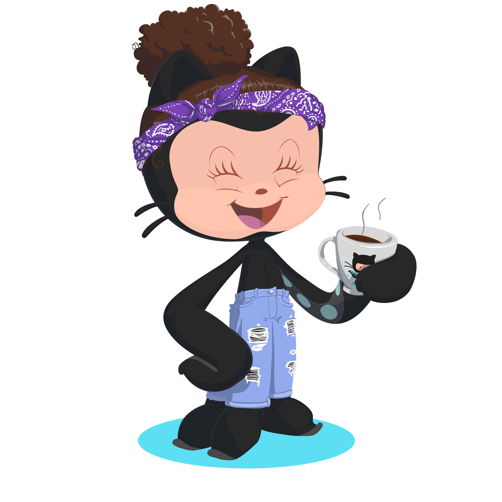

#  DIO - Java
*🌺desafios - feito por Bianca Novaes Olavo🌺*


```System.out.print("Hello, world!")```


> #### Neste repositório você encontrará as minhas resoluções de desafios sobre Colletions Java. <br><br> DIO em parceria com o Santander

<div align="center"></div>
    
